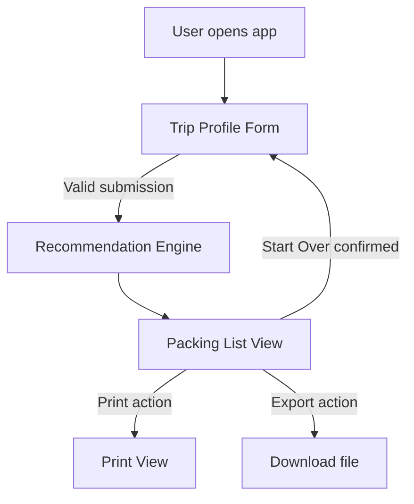
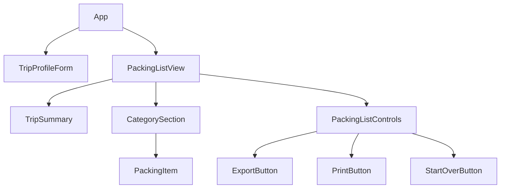
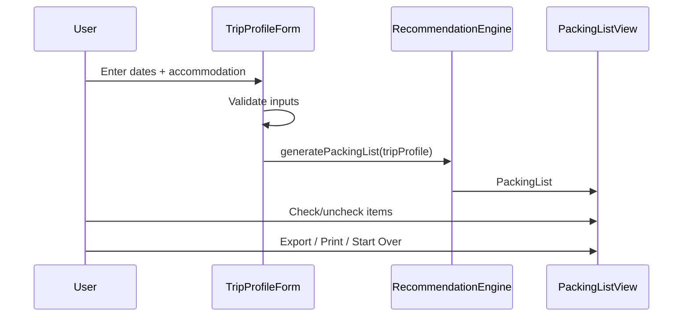

# Design Document: Camino Packing List

## Overview

The Camino Packing List app is a client-side web application that helps pilgrims prepare for the Camino de Santiago. Users enter their trip dates and accommodation type, and the app generates a personalized, categorized packing list that accounts for seasonal weather and lodging-specific needs.

The app is entirely frontend — no backend or database is required. All logic runs in the browser, and session state is held in memory (with no persistence across page reloads). The tech stack is **React** (with TypeScript) for the UI, **Vite** as the build tool, and **Vitest** + **fast-check** for testing.

### Key Design Decisions

- **Pure client-side**: No server needed. The recommendation logic is deterministic and data-light, making a backend unnecessary.
- **React + TypeScript**: Strong typing catches bugs early and makes the recommendation engine logic easy to reason about and test.
- **Vite**: Fast dev server and build tooling with first-class TypeScript support.
- **fast-check**: Property-based testing library for TypeScript/JavaScript, used to verify the recommendation engine's correctness properties.
- **No external state management library**: React's built-in `useState`/`useReducer` is sufficient for this app's complexity.

---

## Architecture

The app follows a simple two-screen flow:

1. **Trip Profile Form** — user enters dates and accommodation type, submits to generate a list.
2. **Packing List View** — displays the generated list with check-off, export, print, and reset actions.



### Component Tree



### Data Flow



---

## Components and Interfaces

### TripProfileForm

Renders the input form. Responsible for:
- Collecting departure date, return date, and accommodation type
- Running client-side validation on submit
- Calling the recommendation engine on valid submission
- Displaying field-level validation error messages

**Props**: `onSubmit: (profile: TripProfile) => void`

### PackingListView

Renders the generated packing list. Responsible for:
- Displaying the trip summary (dates, accommodation, derived season)
- Rendering items grouped by category
- Managing checked state for each item
- Displaying the "X of Y items packed" counter
- Providing export, print, and start-over actions

**Props**: `packingList: PackingList`, `tripProfile: TripProfile`, `onReset: () => void`

### CategorySection

Renders a single category heading and its list of items.

**Props**: `category: Category`, `items: PackingItem[]`, `checkedIds: Set<string>`, `onToggle: (id: string) => void`

### PackingItem

Renders a single item with its checkbox, name, and optional note.

**Props**: `item: Item`, `checked: boolean`, `onToggle: (id: string) => void`

### TripSummary

Renders the trip profile summary above the packing list.

**Props**: `tripProfile: TripProfile`, `season: Season`

### PackingListControls

Renders the export, print, and start-over buttons.

**Props**: `packingList: PackingList`, `tripProfile: TripProfile`, `onStartOver: () => void`

### RecommendationEngine (pure module, not a component)

A pure TypeScript module with no side effects. Exposes:

```typescript
function generatePackingList(profile: TripProfile): PackingList
function detectSeason(departureDate: Date): Season
function validateTripProfile(profile: TripProfileInput): ValidationResult
```

---

## Data Models

```typescript
// Accommodation types supported by the app
type AccommodationType =
  | "Municipal Albergue"
  | "Private Albergue"
  | "Hostel"
  | "Hotel";

// Seasons derived from departure month
type Season = "Spring" | "Summer" | "Autumn" | "Winter";

// Item categories
type Category =
  | "Clothing"
  | "Footwear"
  | "Sleeping"
  | "Toiletries"
  | "Documents"
  | "Electronics"
  | "First Aid";

// A single packing item
interface Item {
  id: string;           // unique identifier
  name: string;         // display name
  category: Category;
  note?: string;        // optional note, max 60 characters
}

// The user's trip inputs (raw form values before validation)
interface TripProfileInput {
  departureDate: string;   // ISO date string from form
  returnDate: string;      // ISO date string from form
  accommodationType: AccommodationType | null;
}

// Validated trip profile used by the recommendation engine
interface TripProfile {
  departureDate: Date;
  returnDate: Date;
  accommodationType: AccommodationType;
  season: Season;          // derived by the engine
  tripDurationDays: number;
}

// The generated packing list
interface PackingList {
  items: Item[];
  generatedAt: Date;
}

// Validation result from validateTripProfile
interface ValidationResult {
  valid: boolean;
  errors: FieldError[];
}

interface FieldError {
  field: "departureDate" | "returnDate" | "accommodationType";
  message: string;
}
```

### Season Detection Logic

| Departure Month | Season  |
|-----------------|---------|
| March–May (3–5) | Spring  |
| June–August (6–8) | Summer |
| September–November (9–11) | Autumn |
| December–February (12, 1, 2) | Winter |

Season is always derived from the **departure date month** only, even if the trip spans two seasons.

### Accommodation Restrictiveness Ranking

For multi-accommodation scenarios (Requirement 3.7), the most restrictive type determines sleeping items:

| Rank (least → most restrictive) | Type |
|---|---|
| 1 (least) | Hotel |
| 2 | Hostel |
| 3 | Private Albergue |
| 4 (most) | Municipal Albergue |

### Item Database Structure

The item database is a static TypeScript constant — a flat array of `Item` objects, each tagged with:
- `category`
- `seasons?: Season[]` — if present, item is only included for those seasons; if absent, item is universal
- `accommodationTypes?: AccommodationType[]` — if present, item is only included for those accommodation types; if absent, item is universal
- `excludeAccommodationTypes?: AccommodationType[]` — if present, item is excluded for those types (used for Hotel sleeping exclusions)

```typescript
interface ItemDefinition extends Item {
  seasons?: Season[];
  accommodationTypes?: AccommodationType[];
  excludeAccommodationTypes?: AccommodationType[];
  isBase?: boolean; // always included regardless of season/accommodation
}
```

The recommendation engine filters this database against the `TripProfile` to produce the final `PackingList`.

---

## Correctness Properties

*A property is a characteristic or behavior that should hold true across all valid executions of a system — essentially, a formal statement about what the system should do. Properties serve as the bridge between human-readable specifications and machine-verifiable correctness guarantees.*

### Property 1: Season detection is total and correct

*For any* valid departure date, `detectSeason` SHALL return exactly one of the four seasons, and the returned season SHALL correspond to the month-to-season mapping: months 3–5 → Spring, months 6–8 → Summer, months 9–11 → Autumn, months 12/1/2 → Winter. The season is always derived from the departure month, even when the trip spans two seasons.

**Validates: Requirements 2.1, 2.2, 2.3**

---

### Property 2: Invalid trip profiles are always rejected

*For any* trip profile input where the departure date is after or equal to the return date, or either date is missing, or the accommodation type is missing, or the trip duration exceeds 90 days, `validateTripProfile` SHALL return `valid: false` with at least one field error and no packing list SHALL be generated.

**Validates: Requirements 1.2, 1.3, 1.5, 1.8**

---

### Property 3: Valid trip profiles are always accepted

*For any* trip profile input where the departure date is strictly before the return date, both dates are present and valid, the accommodation type is one of the four supported types, and the trip duration is ≤ 90 days, `validateTripProfile` SHALL return `valid: true` with no field errors.

**Validates: Requirements 1.7**

---

### Property 4: Base items are always present

*For any* valid trip profile (any season, any accommodation type), the generated packing list SHALL always contain the universal base items: walking poles, blister kit, and pilgrim credential.

**Validates: Requirements 3.4**

---

### Property 5: Sleeping items follow accommodation type

*For any* valid trip profile where the accommodation type is Municipal Albergue or Private Albergue, the generated packing list SHALL include a sleeping bag liner. *For any* valid trip profile where the accommodation type is Hotel, the generated packing list SHALL NOT include a sleeping bag liner or sleep sheet.

**Validates: Requirements 3.5, 3.6**

---

### Property 6: Winter items are always present for Winter trips

*For any* valid trip profile with a departure date in December, January, or February (Winter), the generated packing list SHALL include thermal base layers, a waterproof jacket, and gloves.

**Validates: Requirements 3.8**

---

### Property 7: Summer sun protection is always present for Summer trips

*For any* valid trip profile with a departure date in June, July, or August (Summer), the generated packing list SHALL include sunscreen, a sun hat, and UV-protective clothing.

**Validates: Requirements 3.9**

---

### Property 8: All packing list items have valid categories and names

*For any* generated packing list, every item SHALL belong to one of the defined categories (Clothing, Footwear, Sleeping, Toiletries, Documents, Electronics, First Aid), SHALL have a non-empty name, and any note present SHALL be at most 60 characters long. The list SHALL contain at least one item in each required category.

**Validates: Requirements 3.1, 4.2, 4.3**

---

### Property 9: Toggle state isolation round-trip

*For any* packing list checked state and any item toggle operation, toggling an item and then toggling it again SHALL return the checked set to its original state. Furthermore, toggling any single item SHALL leave the checked state of all other items unchanged.

**Validates: Requirements 5.3, 5.4**

---

### Property 10: Item count display is always accurate

*For any* packing list checked state, the count of checked items SHALL equal the number of items whose checkbox is in the checked state, and the total count SHALL equal the total number of items in the packing list.

**Validates: Requirements 5.3**

---

### Property 11: Canceling start-over preserves all state

*For any* packing list state (any set of checked items, any trip profile), canceling or dismissing the start-over confirmation prompt SHALL leave the packing list, all checked item states, and all trip profile data completely unchanged.

**Validates: Requirements 7.4**

---

## Error Handling

### Form Validation Errors

Validation runs on form submission (not on every keystroke). Each field displays its error message inline, adjacent to the field. Multiple errors can be shown simultaneously. The form does not submit until all errors are resolved.

| Condition | Field | Message |
|---|---|---|
| Departure date missing | departureDate | "Please enter a departure date." |
| Return date missing | returnDate | "Please enter a return date." |
| Departure date in the past | departureDate | "Departure date must be today or in the future." |
| Departure date ≥ return date | departureDate | "Departure date must be before the return date." |
| Trip duration > 90 days | returnDate | "Trip duration cannot exceed 90 days." |
| Accommodation type not selected | accommodationType | "Please select an accommodation type." |

### Recommendation Engine Errors

The engine is a pure function — it does not throw for invalid inputs. Instead, `validateTripProfile` is always called first. If validation fails, the engine is not invoked. This ensures the engine only ever receives valid profiles.

If the engine somehow receives an invalid profile (defensive programming), it returns an empty `PackingList` with zero items, and the UI displays the "no items found" message per Requirement 4.6.

### Export / Print Edge Cases

- If the packing list is empty when print or export is triggered, the app displays an inline message rather than producing blank output (Requirements 6.4, 6.5).
- Export generates a plain-text `.txt` file using the browser's `Blob` + `URL.createObjectURL` API — no server required.

### Start Over Confirmation

The confirmation prompt is a native browser `window.confirm` dialog for simplicity, or a custom modal if the design requires it. If the user cancels, no state is modified.

---

## Testing Strategy

### Dual Testing Approach

The app uses both **unit/example-based tests** and **property-based tests** for comprehensive coverage.

- **Unit tests** (Vitest): Verify specific examples, edge cases, and UI component behavior.
- **Property tests** (Vitest + fast-check): Verify universal properties of the recommendation engine and validation logic across hundreds of generated inputs.

### Property-Based Testing

The recommendation engine is a pure function — it takes a `TripProfile` and returns a `PackingList`. This makes it an ideal candidate for property-based testing.

**Library**: [fast-check](https://fast-check.dev/) — a mature property-based testing library for TypeScript/JavaScript.

**Configuration**: Each property test runs a minimum of **100 iterations** (fast-check default is 100; increase to 200 for critical properties).

**Tag format**: Each property test is tagged with a comment:
```
// Feature: camino-packing-list, Property N: <property_text>
```

**Properties to implement as property-based tests**:

| Property | Test Description |
|---|---|
| Property 1 | Generate arbitrary valid dates across all months; verify `detectSeason` returns the correct season per the month mapping |
| Property 2 | Generate invalid trip profile inputs (bad dates, missing fields, >90 days); verify `validateTripProfile` always returns `valid: false` |
| Property 3 | Generate valid trip profile inputs; verify `validateTripProfile` always returns `valid: true` with no errors |
| Property 4 | Generate arbitrary valid profiles; verify walking poles, blister kit, and pilgrim credential are always present |
| Property 5 | Generate profiles with albergue types; verify sleeping bag liner is present. Generate profiles with Hotel type; verify sleeping items are absent |
| Property 6 | Generate profiles with Winter departure dates; verify thermal base layers, waterproof jacket, and gloves are present |
| Property 7 | Generate profiles with Summer departure dates; verify sunscreen, sun hat, and UV-protective clothing are present |
| Property 8 | Generate arbitrary valid profiles; verify all items have valid categories, non-empty names, and notes ≤ 60 chars |
| Property 9 | Generate arbitrary checked states and toggle operations; verify round-trip invariant and state isolation |
| Property 10 | Generate arbitrary checked states; verify displayed count equals number of checked items |
| Property 11 | Generate arbitrary packing list states; verify canceling start-over leaves all state unchanged |

### Unit Tests

Unit tests cover:
- Form validation: each error condition with a concrete example
- Season detection: one example per season boundary month (March, June, September, December)
- Recommendation engine: specific accommodation type combinations
- Export: verify file content format with a known packing list
- Print view: verify no interactive elements are rendered
- Start Over: confirm dialog behavior (confirm vs. cancel)
- Empty list: verify "no items found" message is shown

### Component Tests

React component tests (using Vitest + React Testing Library):
- `TripProfileForm`: renders all fields, shows errors on invalid submit, calls `onSubmit` on valid submit
- `PackingListView`: renders items grouped by category, updates count on toggle
- `PackingItem`: checkbox toggles correctly, strikethrough applied when checked
- `TripSummary`: displays all trip profile fields correctly

### Test File Structure

```
src/
  engine/
    recommendationEngine.ts
    recommendationEngine.test.ts       # unit + property tests for engine
    seasonDetection.ts
    seasonDetection.test.ts            # unit + property tests for season detection
    validation.ts
    validation.test.ts                 # unit + property tests for validation
  components/
    TripProfileForm/
      TripProfileForm.tsx
      TripProfileForm.test.tsx
    PackingListView/
      PackingListView.tsx
      PackingListView.test.tsx
    PackingItem/
      PackingItem.tsx
      PackingItem.test.tsx
  data/
    items.ts                           # static item database
```
